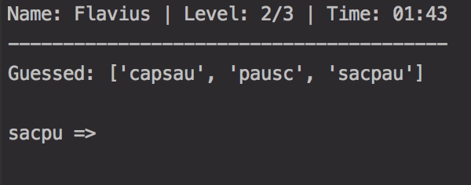

## The Game ##
The Word Game is a test of determination and grit, challenging the user to solve a series of anagram puzzles.
Each successive puzzle get increasingly harder. Can you finish the game in record time? 

## The Catch ##
An unsolvable puzzle is introduced in level 3 in order to measure the player's resiliency. After numerous incorrect guesses,
a help prompt is displayed that will allow the player to skip the unsolvable puzzle for a solvable one.  